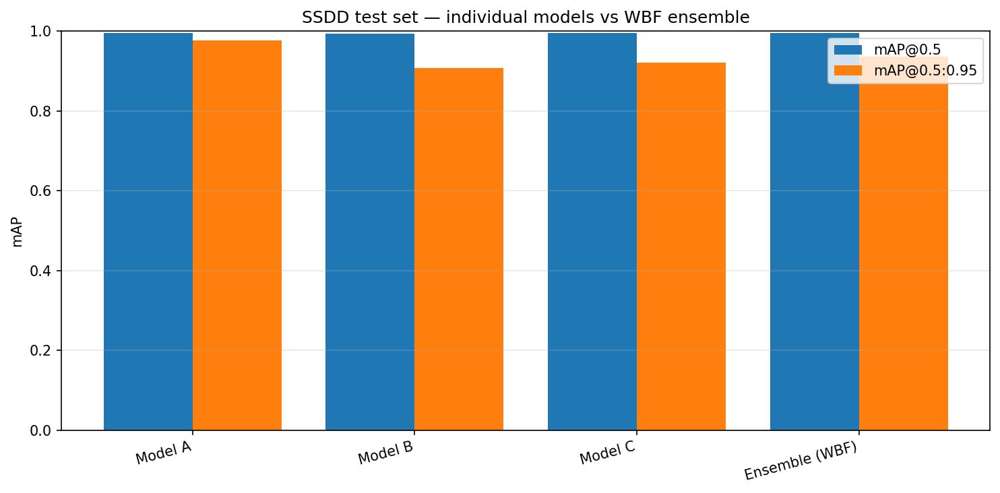
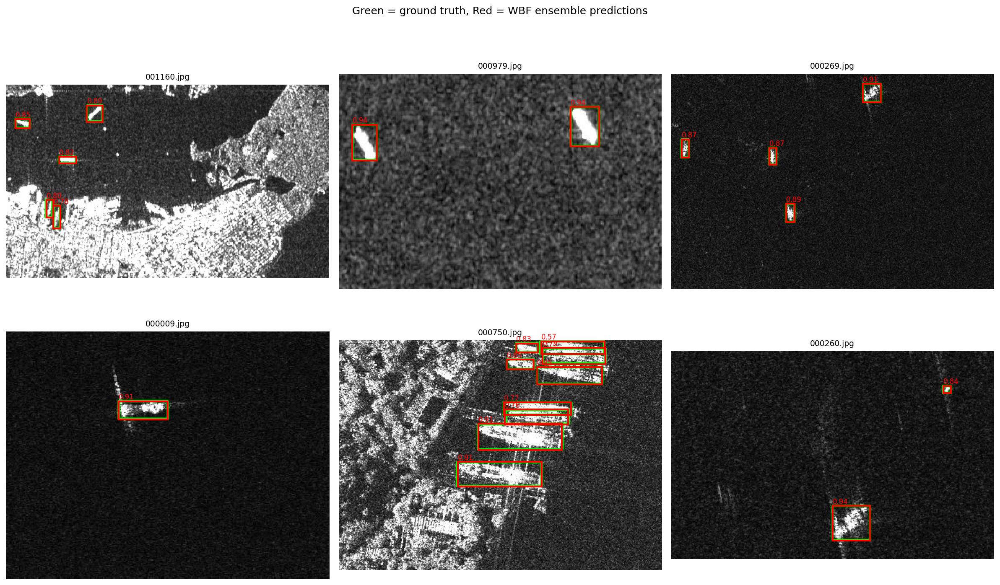

# Ship Detection in SAR Satellite Images  
### YOLOv8 + YOLOv11 + Weighted Box Fusion Ensemble

[]()
[]()
[]()
[]()

This repository contains a computer vision project for **automatic ship detection in Synthetic Aperture Radar (SAR) satellite imagery**.  
The system detects ships using YOLO-based object detection models and combines multiple model predictions using **Weighted Box Fusion (WBF)**.

The project was developed as an academic Computer Vision project and is structured for reproducibility, report presentation, and portfolio use.

---

## Project Overview

Maritime surveillance requires fast and reliable detection of ships across large ocean regions. Manual inspection of satellite images is slow, expensive, and difficult to scale. This project uses deep learning to automatically localize ships in SAR satellite images by predicting bounding boxes around vessels.

SAR imagery is useful for maritime monitoring because radar-based satellite imaging can operate under conditions where normal optical imagery is weaker, such as low-light or cloud-covered scenarios. However, SAR ship detection is challenging because ships are often small, images are noisy, and coastlines or bright background scatter can create false positives.

---

## Key Objectives

- Detect ships in SAR satellite images using YOLO-based object detection.
- Convert SSDD annotations from PASCAL VOC XML format into YOLO format.
- Train and compare multiple detectors:
  - **Model A:** YOLOv8s
  - **Model B:** YOLOv11s
  - **Model C:** YOLOv8m with heavier augmentation
- Fuse model predictions using **Weighted Box Fusion**.
- Evaluate performance using precision, recall, F1-score, mAP@0.5, and mAP@0.5:0.95.
- Generate report-ready visual results for GitHub, LinkedIn, and academic presentation.

---

## Methodology

The complete pipeline follows this workflow:

```text
SSDD SAR Dataset
        ↓
Extract images and XML annotations
        ↓
Convert PASCAL VOC bounding boxes to YOLO format
        ↓
Create train / validation / test split
        ↓
Train YOLOv8s, YOLOv11s, and YOLOv8m
        ↓
Evaluate individual models
        ↓
Apply Weighted Box Fusion ensemble
        ↓
Generate metrics, comparison chart, and qualitative detections
```

---

## Dataset

This project uses the **SSDD SAR Ship Detection Dataset**.

The dataset contains SAR satellite images with ship bounding-box annotations.  
The original large dataset archive is **not included in this repository** because GitHub blocks files above 100 MB and large datasets should not be committed directly into Git history.

Expected local/Colab dataset file:

```text
Official-SSDD-OPEN.rar
```

Recommended location for Google Colab execution:

```text
MyDrive/ship-detection/Official-SSDD-OPEN.rar
```

---

## Model Design

Three models were trained to create diversity in architecture, augmentation, and learned features.

| Model | Backbone | Training Strategy | Purpose |
|---|---|---|---|
| Model A | YOLOv8s | Standard augmentation | Strong baseline |
| Model B | YOLOv11s | Medium augmentation | Newer architecture comparison |
| Model C | YOLOv8m | Heavy augmentation | Higher-capacity model with stronger variation |
| Ensemble | WBF | Fuses predictions from A, B, and C | More stable combined detections |

---

## Weighted Box Fusion

Instead of simply selecting one predicted box and discarding the rest, **Weighted Box Fusion** combines overlapping boxes from multiple models.

WBF works by:

1. Collecting predictions from all trained detectors.
2. Grouping boxes that overlap strongly.
3. Computing a weighted average of box coordinates using confidence scores.
4. Producing a fused prediction box with a final confidence score.

This is useful when multiple models detect the same ship with slightly different bounding boxes.

---

## Results on SSDD Test Set

| Model | Precision | Recall | F1 | mAP@0.5 | mAP@0.5:0.95 |
|---|---:|---:|---:|---:|---:|
| Model A — YOLOv8s | 0.9960 | 0.9981 | 0.9971 | 0.9950 | 0.9776 |
| Model B — YOLOv11s | 0.9907 | 0.9896 | 0.9901 | 0.9946 | 0.9070 |
| Model C — YOLOv8m (heavy aug) | 0.9976 | 0.9944 | 0.9960 | 0.9950 | 0.9215 |
| Ensemble (WBF) | 0.9926 | 0.9981 | 0.9954 | 0.9950 | 0.9365 |

### Result Interpretation

The models achieved very high detection performance on the SSDD test set.  
The **YOLOv8s baseline produced the strongest strict localization score**, with the highest mAP@0.5:0.95. The WBF ensemble matched the top mAP@0.5 score and maintained high recall, but it did not outperform YOLOv8s on every metric.

That distinction matters. A professional result section should not exaggerate the ensemble result. The honest conclusion is:

> The WBF ensemble produced stable fused predictions and strong recall, while YOLOv8s remained the best individual model under stricter localization evaluation.

---

## Performance Comparison

The chart below compares the individual models and the WBF ensemble on the SSDD test set.



---

## Qualitative Detection Samples

Green boxes represent ground-truth ship annotations.  
Red boxes represent WBF ensemble predictions with confidence scores.



These examples show that the model can detect ships in different SAR backgrounds, including dark ocean regions, cluttered coastal areas, and scenes with multiple ships.

---

## Repository Structure

```text
Ship-detection-CV-Project/
│
├── Code/
│   └── ship_detection_v2.ipynb
│
├── Doc/
│   ├── EXPLANATION.md
│   ├── Ship_detection_using_ensemble_deep_learning_techni.pdf
│   ├── cv props.docx
│   └── report_artifacts/
│       ├── map_comparison.png
│       ├── qualitative_samples.png
│       └── results_table.csv
│
├── .gitignore
└── README.md
```

The following files/folders are intentionally excluded from GitHub:

```text
DataSet/
Code/weights/
*.rar
*.zip
*.pt
*.pth
*.onnx
.env
.venv
```

---

## How to Run the Project

### 1. Clone the repository

```bash
git clone https://github.com/haris-byte/Ship-detection-CV-Project.git
cd Ship-detection-CV-Project
```

### 2. Open the notebook

Open this file in Google Colab or Jupyter Notebook:

```text
Code/ship_detection_v2.ipynb
```

For best performance, use Google Colab with a GPU runtime.

```text
Runtime → Change runtime type → T4 GPU
```

### 3. Install dependencies

The notebook installs the required packages automatically:

```bash
pip install ultralytics==8.3.40 ensemble-boxes==1.0.9 supervision==0.25.1 pyyaml
```

### 4. Add the dataset

Place the SSDD dataset archive in your Google Drive:

```text
MyDrive/ship-detection/Official-SSDD-OPEN.rar
```

The notebook extracts the archive, converts annotations, trains the models, and saves results.

---

## Main Technologies Used

- Python
- PyTorch
- Ultralytics YOLO
- YOLOv8
- YOLOv11
- Weighted Box Fusion
- OpenCV
- NumPy
- Pandas
- Matplotlib
- Supervision
- Google Colab
- SSDD SAR ship dataset

---

## Evaluation Metrics

| Metric | Meaning |
|---|---|
| Precision | How many predicted ships were actually ships |
| Recall | How many real ships were detected |
| F1-score | Balance between precision and recall |
| mAP@0.5 | Mean Average Precision at IoU threshold 0.5 |
| mAP@0.5:0.95 | Stricter COCO-style localization metric across multiple IoU thresholds |

The stricter metric, **mAP@0.5:0.95**, is more meaningful when comparing bounding-box quality because it rewards more accurate localization.

---

## Limitations

This project is strong as an academic and portfolio project, but it should not be oversold as a production maritime surveillance system.

Current limitations:

- Results are reported on the SSDD test set only.
- Cross-dataset testing on HRSID or another SAR dataset should be added for a stronger generalization claim.
- Real-time deployment was not tested on edge devices or live satellite data streams.
- Model weights are not included in the repository due to file-size limits.
- The ensemble method increases inference cost compared with a single YOLO model.

---

## Future Improvements

- Add HRSID cross-dataset evaluation.
- Compare WBF against standard NMS and Soft-NMS.
- Add inference script for single-image prediction.
- Add a lightweight web demo using Streamlit or Gradio.
- Export best model to ONNX for deployment testing.
- Add FPS and inference-time benchmarking.
- Evaluate robustness on dense ports, near-shore scenes, and low-contrast images.

---

## LinkedIn Project Summary

> Built a SAR satellite ship detection pipeline using YOLOv8, YOLOv11, and Weighted Box Fusion. The project includes dataset conversion from PASCAL VOC to YOLO format, training of three object detection models, ensemble prediction fusion, and SSDD test-set evaluation. The best model achieved 0.9950 mAP@0.5 and 0.9776 mAP@0.5:0.95, with report-ready visualizations for qualitative detection analysis.

---

## Academic Context

This project was developed as part of a Computer Vision academic project at Superior University, Department of Information Engineering Technology.

Project focus:

```text
Ship Detection in Satellite Images using Ensemble Deep Learning Techniques
```

---

## Reference

This project is inspired by research on YOLO-based ensemble learning and Weighted Box Fusion for SAR ship detection:

```text
Gupta et al. (2024), "Ship detection using ensemble deep learning techniques from synthetic aperture radar imagery", Scientific Reports.
```

---

## Author

**Haris Ali**  
Computer Vision | Deep Learning | Remote Sensing | Object Detection

GitHub: [haris-byte](https://github.com/haris-byte)

---

## Final Note

The strongest part of this repository is not only the high mAP score.  
The stronger portfolio signal is the complete pipeline: dataset preparation, model training, ensemble fusion, metric evaluation, and visual reporting.

That is what makes this project presentable for GitHub and LinkedIn.
